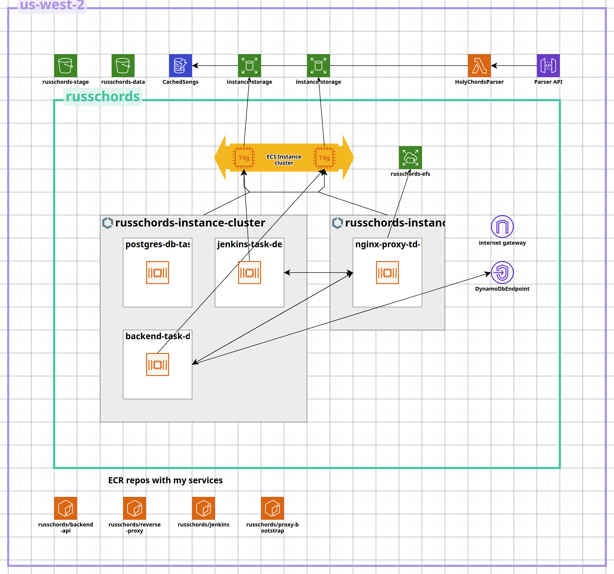

# russchords – aws infrastructure

Here is CloudCraft snapshot. Cannot say it's comprehensive, but it shows something.

In case you really want to get what’s going on here, first of all - thank you, here is a quick summary of all the "architecture".

## 1. Frontend
- React app builds in **Jenkins**, deployed to **S3**.  
- Served globally through **CloudFront**.  

## 2. Backend
- **ASP.NET Core API** running on **ECS (EC2 launch type)**.  
- **nginx proxy servers** handle forward/reverse routing and traffic entry.  
- Jenkins automates builds; **AWS CodeBuild** used for heavy builds.  

## 3. Data Layer
- **PostgreSQL** (ECS task) – primary database.  
- **DynamoDB** – caching “temporary songs” parsed from source.  
- **EFS** – stores configs and certs (nginx, Jenkins).  
- **S3** – one bucket for the deployed website, another for utility storage.  

## 4. Networking
- Single **VPC** with multiple subnets (currently only public subnets in use).  
- Internet access for services routed through nginx proxies (instead of NAT gateways).  

## 5. Security & Identity
- **AWS Cognito** as identity provider.  
- **IAM roles & policies** designed with least privilege principle.  

## 6. Observability
- **CloudWatch** logs and metrics for ECS tasks, Jenkins, and Lambda.  

## 7. CI/CD
- **Jenkins** runs on ECS cluster as a service.  
- Pipeline: build → push to **ECR** → deploy to ECS.  
- **AWS CodeBuild** supports heavy builds.  
- Infrastructure as Code (Terraform) → in progress.  

## 8. Nginx Proxy Design
- Two **nginx proxies** replace costly ALB/ASG setup.  
- Provide single IP entry point for app and API.  
- Route traffic between backend services.  
- Allow services to make outbound internet requests.  
- Design remains **compatible with ALB + Auto Scaling Group** for future scaling.  